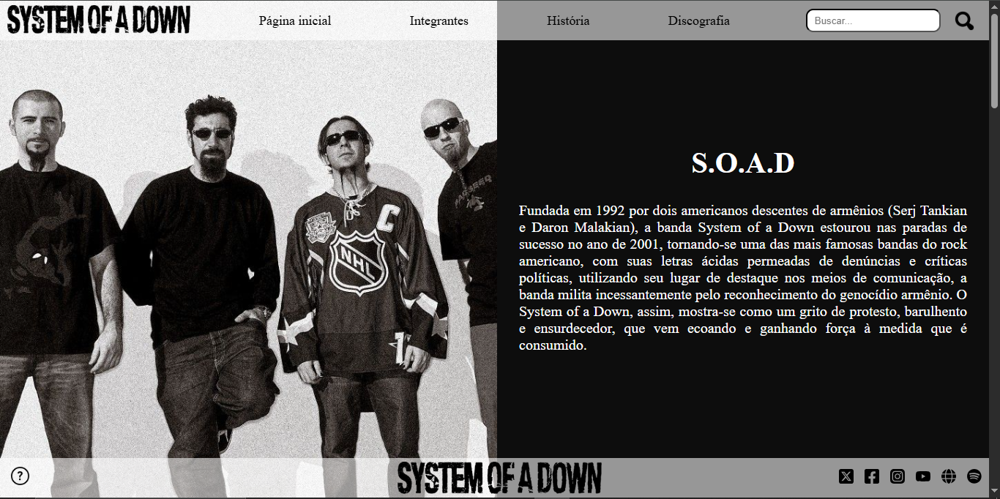
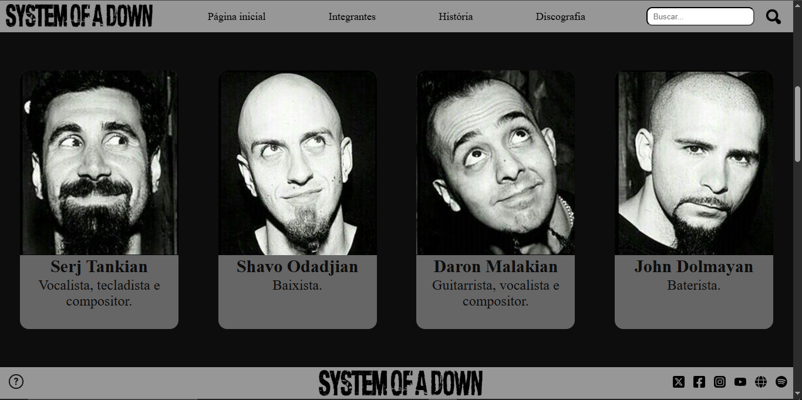
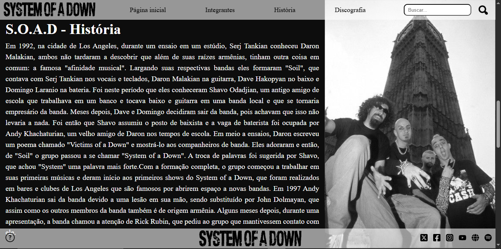
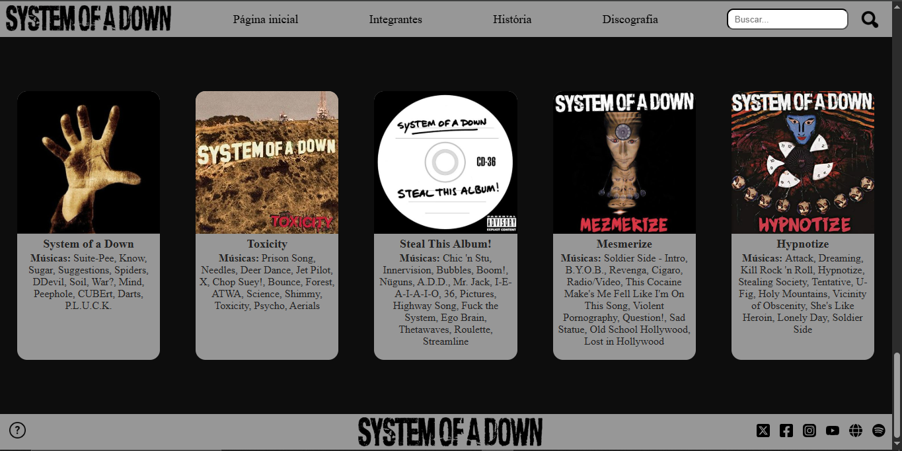

# System Of A Down - Project-Page
## Desenvolvimento de site em HTML e CSS.

| Status | Data da Última Atualização |
| :--- | :--- |
| **Concluído** | 17/10/2025 |

## Sobre o Projeto

Este projeto consiste em uma homepage temática criada a partir de conceitos básicos e estruturas essenciais de HTML e CSS.

---

## Imagens do site
| Página inicial |
| :---: |
|  |

| Integrantes |
| :---: |
|  |

| História |
| :---: |
|  |

| Discografia |
| :---: |
|  |
---

## Autor

| Nome | Contato |
| :--- | :--- |
| Ana Clara Lobo Silveira | https://github.com/Ana-Clara-Lobo-Silveira |